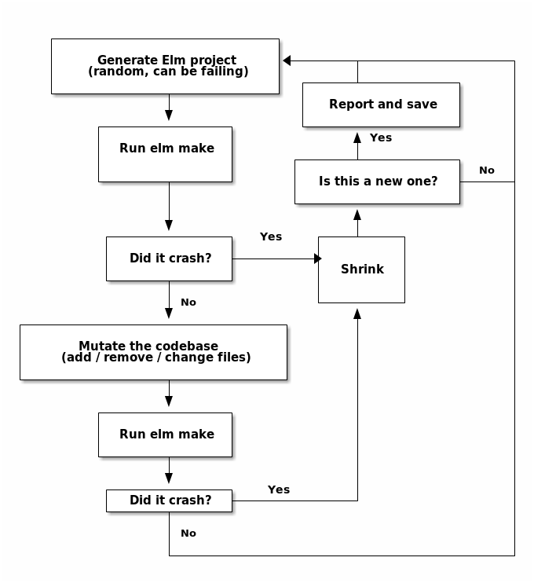

# elm-compiler-fuzz

## TODO:

- [ ] actually trigger a crash :)
- [ ] when that happens, implement shrinking
- [ ] if that doesn't happen, rethink code generation (modules probably need to successfully compile?) and mutations (changes in code seem like a promising target)
